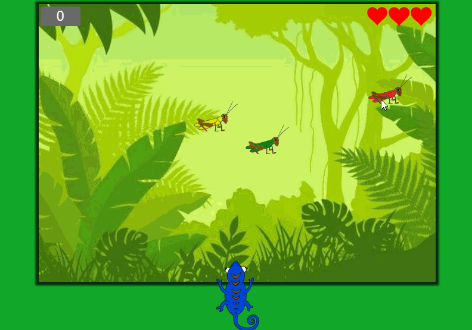

# Hungry Chamaleon
## Introduction
It’s a game to entertain you in those dead times you could have.
## Game description
You have to catch the grasshopper, who has the same color of your chamaleon, but be carefull!, your chamaleon changes his color very fast and the grasshopper dissapear very fast too!
You have 3 lives, and if you catch the wrong grasshopper you loose a live, and the grasshoppers are a little bit mockers.
## Game example


## Code sample
```[Javascript]
        const B = Math.abs(500 - that.posX);
        const A = 700 - that.posY;
        var angle = Math.PI/2 - Math.atan(A/B);
        if (that.posX < 500) {
          angle *= -1
        }
        
        var tongue = document.getElementById('tongue');
        tongue.style.transform = `rotate(${angle}rad)`

        var tongue_height = 0;

        let timerId = setInterval(function(){
          tongue.style.height = `${tongue_height += 30}px`;
          tongue.style.bottom = `-${tongue_height/2}px`;
          if (tongue_height >= (700-that.posY)*2){ 
            clearInterval(timerId);
            let timerId2 = setInterval(function(){
              tongue.style.height = `${tongue_height -= 30}px`;
              tongue.style.bottom = `-${tongue_height/2}px`;
              if (tongue_height < 10) {
                clearInterval(timerId2);
              }
